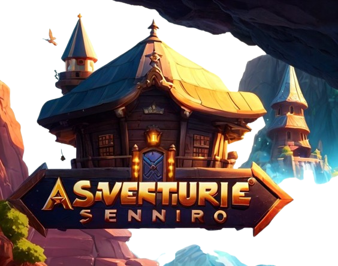

# About Adventure Studio Designer

**Adventure Studio Designer** was born with the idea of giving life back to a type of game that was embraced by an entire generation, conversational adventures. Surely you remember adventures like the [Hobbit](https://bbcmicro.co.uk/jsbeeb/play.php?autoboot&disc=https://bbcmicro.co.uk/gameimg/discs/1681/Disc094-HobbitSTT.ssd&noseek) or those created by the company [Aventuras AD](https://es.wikipedia.org/wiki/Aventuras_AD).

Nowadays a very huge of people around the world are creating, playing and distributing this kind of game. In Spain the [CAAD](https://caad.club/) provides news, support, forums and a distributing channel for those people.

I was one of these people who spent a lot of hours playing Conversational Adventures Games and who believe that with the new technologies, we can give a new nut turn to an enhanced Conversational Adventures using voice recognition, text-to-speech for disabled people, videos and animated scenes to recreate a more realistic situation, and as I believe, a channel to tell the History to our descendants and teach them to use the writing, use the imagination, use the intelligence to resolve enigmas, in summary show them a very, although unknown new game type. The Conversational Adventure.

## How to achieve that

I am a normal person, husband, father, grandfather and technology enthusiast. I know  I don't have much free time to develop but I will try to push new features every week.

As you might have deduced, not all of the features listed below will be available immediately, but I will make every effort to implement them over time. 

The plan is to use PHP as the base language for the backend project, and ReactJS for the user interface project. It is probably to use some well-known framework like Laravel or NextJs respectively. The persisting layer will be in charge of the SQLite database to make the project as compact as possible and to reduce the fingerprint in whatever system you want to run it, and finally, the whole system will be deployed as a dockerized version, to make possible the premise of "download-and-play" and to make it easy to deploy to, almost, every operative system in the world.

Sometimes to achieve some features I will base on public libraries, and sometimes in other languages but always with the main goal in mind, provide a good and easy to use product.

## Key Features:  

**Multilingual Support:**

- It supports multiple languages, and it will let you develop your adventures, catering to a global audience.
- Adventure Studio Designer will support a wide array of languages with a Natural Language Processing Engine (NPLE) and ensure your stories can be played in several languages and, of course,  reach players without matter the language barrier.

**Import from Popular Engines:**

- Seamlessly import projects from well-known engines like PQWS and DAAD. This capability ensures that you can continue your existing projects within Adventure Studio Designer without losing any progress, providing a smooth transition and enhanced workflow.

**Integrated Development Environment (IDE):**

- Our powerful IDE is designed specifically for creating conversational adventures. It features a user-friendly interface, advanced debugging tools, and comprehensive documentation to assist both novice and experienced developers in crafting intricate and immersive stories.

**Compiler and Interpreter:**

- Adventure Studio Designer includes a robust compiler and interpreter, enabling real-time testing and execution of your adventures. This ensures that you can iterate quickly, refining your narrative and gameplay elements to perfection.

**Cross-Platform Compatibility:**

- Create adventures that can be played across multiple platforms, including desktop, mobile, and the web. Our versatile framework will ensure your stories are accessible to players on their preferred devices.
- This will be possible because the entire application, as an open-source platform, will be built on standard, well-known, open-source libraries, frameworks, and tools, thus maintaining availability for the whole community.

**Rich Media Integration:**

- Enhance your adventures with rich media elements, including images, sound, and animations. Adventure Studio Designer supports various media formats, allowing you to create a more immersive and engaging experience for players.
- No worries if you want to use a specific format. You will be able to develop your plugin and integrate it into the IDE, letting the community use that format.

**New technologies for old games:**
- Integrate the new technologies like text-to-speech, video or the natural language processing, among others, is one of the proposal of this project and give a new blow of life to this _abandon_ kind of games.

**Community and Support:**

- Join a vibrant community of storytellers and developers. Share your projects, collaborate on ideas, and receive support from fellow creators.
- We will create a full set of comprehensive support resources and active forums ensuring you have the help you need to bring your adventures to life.

**Adventure Studio Designer** is more than just a tool; it's a gateway to endless possibilities in interactive storytelling. Whether you will craft a simple text-based adventure or a complex, branching narrative, **Adventure Studio Designer** provides the tools and support you need to turn your vision into reality. Dive into the world of conversational adventures and start creating today!

## Contributing

Thank you very much for considering contributing to the Adventure Studio Designer! Everyone will be welcome, you just need to write to [moesis@gmail.com](mailto:moesis@gmail.com) and tell us how you can and why you want to collaborate with the project.

## Code of Conduct

In order to ensure that the Adventure Studio Designer community is welcoming to all, please review and abide by the Code of Conduct.

## Security Vulnerabilities

If you discover a security vulnerability or a security tread, please send an e-mail to Adventure Studio Designer via [info@ads.com](mailto:taylor@laravel.com). All security vulnerabilities will be promptly addressed.

## License

The Adventure Studio Designer is open-sourced software licensed under the [GNU GENERAL PUBLIC LICENSE 3.0](https://opensource.org/license/gpl-3-0).
